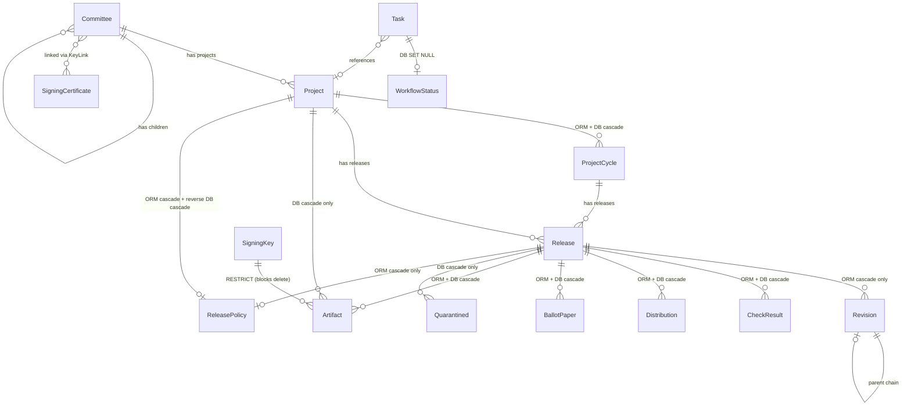
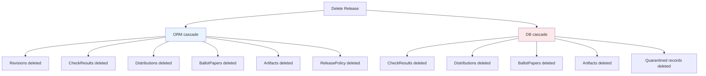
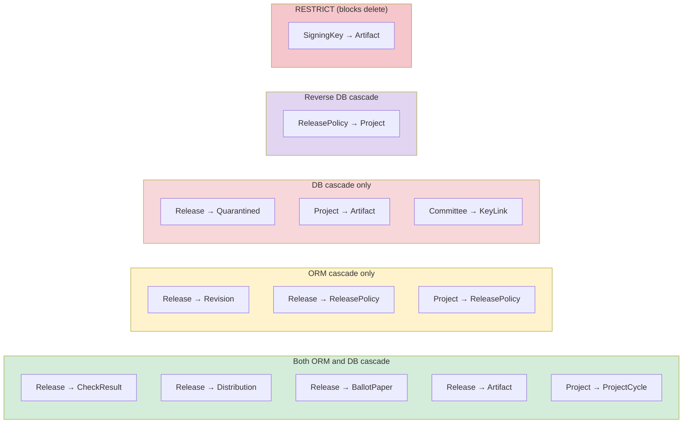

# 3.8. Database

**Up**: `3.` [Developer guide](developer-guide)

**Prev**: `3.7.` [Running and creating tests](running-and-creating-tests)

**Next**: `3.9.` [Storage interface](storage-interface)

**Sections**:

* [Introduction](#introduction)
* [Core models](#core-models)
* [Other features](#other-features)
* [Cascade deletions](#cascade-deletions)
* [Schema changes and migrations](#schema-changes-and-migrations)

## Introduction

ATR stores all of its data in a SQLite database. The database schema is defined in [`models.sql`](/ref/atr/models/sql.py) using [SQLModel](https://sqlmodel.tiangolo.com/), which uses [Pydantic](https://docs.pydantic.dev/latest/) for data validation and [SQLAlchemy](https://www.sqlalchemy.org/) for database operations. This page explains the main features of the database schema to help you understand how data is structured in ATR.

## Core models

The most important models in ATR are [`Committee`](/ref/atr/models/sql.py) (Committee), [`Project`](/ref/atr/models/sql.py) (Project), [`Release`](/ref/atr/models/sql.py) (Release), and [`Artifact`](/ref/atr/models/sql.py) (Artifact).

A [`Committee`](/ref/atr/models/sql.py) (Committee) represents a PMC or PPMC at the ASF. Each committee has a key, which is the primary key, and an optional name from which its display name is derived (falling back to the key, and marked as incubating for podlings). Committees can have child committees, which is used for the relationship between the Incubator PMC and individual podling PPMCs. Committees also have lists of committee members and committers stored as JSON arrays.

A [`Project`](/ref/atr/models/sql.py) (Project) belongs to a committee and can have multiple releases. Projects have a key as the primary key, along with metadata such as a description and category and programming language tags. Each project can optionally have a [`ReleasePolicy`](/ref/atr/models/sql.py) (ReleasePolicy) that defines how releases should be handled, including e.g. vote templates and GitHub workflow configuration.

A [`Release`](/ref/atr/models/sql.py) (Release) belongs to a project and represents a specific version of software which is voted on by a committee. The primary key is a key derived from the project key and version. Releases have a phase that indicates their current state in the release process, from draft composition to final publication. Each release can have multiple [`Revision`](/ref/atr/models/sql.py) (Revision) instances before final publication, representing iterations of the underlying files. Each vote cast during the committee vote is recorded as a [`BallotPaper`](/ref/atr/models/sql.py) (BallotPaper), which captures the voter, their choice, whether their vote was binding at the time, and the revision it was cast against.

An [`Artifact`](/ref/atr/models/sql.py) (Artifact) represents a single distributable file, such as a source tarball or a convenience binary, together with the paths to its detached signature, checksum, and CycloneDX SBOM where those exist. The release catalogue is built from artifacts: each one records the project and version it belongs to, the fingerprint of the key that signed it, and whether it came through ATR (`managed`) or was catalogued from an existing dist tree. An artifact links to a release when there is one, but its `release_key` is nullable, so historical artifacts catalogued from SVN without a matching ATR release are still represented.

## Other features

The models themselves are the most important components, but to support those models we need other components such as the release cycle model, enumerations, column types, automatically populated fields, computed properties, and constraints.

### Project cycles

Between a project and its releases sits the [`ProjectCycle`](/ref/atr/models/sql.py) (ProjectCycle), which represents a release cycle within a project, for example `"2.x"`, `"default"`, or `"2026"`. Every project has at least one cycle: projects whose `version_method` is `"simple"` keep a single cycle named `"default"` and never expose cycle UI, while semver and calver projects can have several. Each [`Release`](/ref/atr/models/sql.py) (Release) belongs to a cycle as well as to its project, via `Release.cycle_key`.

A cycle also caches its lifecycle dates (`eod`, `eos`, `eol`) from the most recent matching [`LifecycleEvent`](/ref/atr/models/sql.py) (LifecycleEvent), where the events table is the source of truth and the columns are a denormalised cache so that "what is currently planned" reads cheaply.

### Enumerations

ATR uses Python enumerations to ensure that certain fields only contain valid values. The most important enumeration is [`ReleasePhase`](/ref/atr/models/sql.py) (ReleasePhase), which defines the four phases of a release: `RELEASE_CANDIDATE_DRAFT` for composing, `RELEASE_CANDIDATE` for voting, `RELEASE_PREVIEW` for finishing, and `RELEASE` for completed releases.

The [`TaskStatus`](/ref/atr/models/sql.py) (TaskStatus) enumeration defines the states a task can be in: `QUEUED`, `ACTIVE`, `COMPLETED`, `FAILED`, or `BROKEN`. `BROKEN` is a separate terminal state, used only for check tasks that couldn't produce a real verdict, for example because the worker timed out or hit a retryable error, as opposed to `FAILED`, which means the task itself genuinely errored. Keeping the two apart lets ATR tell "we couldn't check this" from "this check failed". The [`TaskType`](/ref/atr/models/sql.py) (TaskType) enumeration lists all the different types of background tasks that ATR can execute, from signature checks to SBOM generation.

The [`DistributionPlatform`](/ref/atr/models/sql.py) (DistributionPlatform) enumeration is more complex, as each value contains not just a name but a [`DistributionPlatformValue`](/ref/atr/models/sql.py) (DistributionPlatformValue) with template URLs and configuration for different package distribution platforms like PyPI, npm, and Maven Central.

### Special column types

SQLite does not support all the data types we need, so we use SQLAlchemy type decorators to handle conversions. The [`UTCDateTime`](/ref/atr/models/sql.py) (UTCDateTime) type ensures that all datetime values are stored in UTC and returned as timezone-aware datetime objects. When Python code provides a datetime with timezone information, the type decorator converts it to UTC before storing. When reading from the database, it adds back the UTC timezone information.

The [`ResultsJSON`](/ref/atr/models/sql.py) (ResultsJSON) type handles storing task results. It automatically serializes Pydantic models to JSON when writing to the database, and deserializes them back to the appropriate result model when reading.

### Automatic field population

Some fields are populated automatically using SQLAlchemy event listeners. When a new [`Revision`](/ref/atr/models/sql.py) (Revision) is created, the [`populate_revision_sequence_and_key`](/ref/atr/models/sql.py) (populate_revision_sequence_and_key) function runs before the database insert. Rather than reading back the highest existing sequence number, it allocates the next one from a per-release counter row in [`RevisionCounter`](/ref/atr/models/sql.py) (RevisionCounter) using an upsert. That means sequence numbers are never reused, even after revisions or whole releases are deleted. The function sets the `seq` field, the zero-padded `number` field, the `key` (built from the release key and number), and the `parent_key` pointing at the previous revision in the chain.

The [`check_release_key`](/ref/atr/models/sql.py) (check_release_key) function runs before inserting a release. If the release key is empty, it automatically generates it from the project key and version using the [`release_key`](/ref/atr/models/sql.py) (release_key) helper function.

When a new [`Project`](/ref/atr/models/sql.py) (Project) is inserted, the [`populate_default_project_cycle`](/ref/atr/models/sql.py) (populate_default_project_cycle) function runs after the insert and creates a `"default"` [`ProjectCycle`](/ref/atr/models/sql.py) (ProjectCycle) for it. This gives every project at least one cycle, so that `Release.cycle_key` always has a valid foreign key target without writers having to do that bookkeeping themselves.

### Computed properties

Some properties are computed dynamically rather than stored in the database. The `Release.latest_revision_number` property is backed by a SQLAlchemy column property that uses a correlated subquery. The subquery is defined once in [`RELEASE_LATEST_REVISION_NUMBER`](/ref/atr/models/sql.py) (RELEASE_LATEST_REVISION_NUMBER) and attached to the `Release` class as the private `_latest_revision_number` column property, so it is populated by whatever query loads the release. The public `latest_revision_number` is a Pydantic computed field that reads that value back, which is why it needs the loading session to still be active.

Projects have many computed properties that provide access to release policy settings with appropriate defaults. For example, `Project.policy_start_vote_template` returns the custom vote template if one is configured, or falls back to the default vote template if not. This pattern allows projects to customize their release process while providing sensible defaults.

### Constraints and validation

Database constraints ensure data integrity. The [`Task`](/ref/atr/models/sql.py) (Task) model includes a check constraint that validates the status transitions. A task must start in `QUEUED` state, can only transition to `ACTIVE` when `started` and `pid` are set, and can only reach a terminal state (`COMPLETED`, `FAILED`, or `BROKEN`) when the `completed` timestamp is set. `COMPLETED` additionally requires a `result`, and both `FAILED` and `BROKEN` require an `error`. These constraints prevent invalid state transitions at the database level.

Unique constraints ensure that certain combinations of fields are unique. The `Release` model has a unique constraint on `(project_key, version)` to prevent creating duplicate releases for the same project version. The `Revision` model has two unique constraints: one on `(release_key, seq)` and another on `(release_key, number)`, ensuring that revision numbers are unique within a release.

## Cascade deletions

ATR uses two kinds of cascade deletions: ORM-level cascades managed by SQLAlchemy, and DB-level cascades enforced by SQLite foreign key constraints. Both are configured in [`models/sql.py`](/ref/atr/models/sql.py). This section documents what happens when a parent record is deleted, which child records are automatically removed, and which deletions are blocked by foreign key constraints.

SQLite foreign key enforcement is enabled in ATR via `PRAGMA foreign_keys=ON` in [`db/__init__.py`](/ref/atr/db/__init__.py). This means DB-level cascades and foreign key constraints are active.

### ORM-level vs DB-level cascades

ORM cascades are configured on SQLAlchemy relationships using `sa_relationship_kwargs={"cascade": "all, delete-orphan"}`. When a parent object is deleted through the ORM (via `session.delete(parent)`), SQLAlchemy automatically deletes all related child objects before issuing the SQL DELETE for the parent. These cascades only apply when using the ORM; they do not apply to raw SQL DELETE statements or bulk `sqlmodel.delete()` queries.

DB-level cascades are configured on foreign key columns using `ondelete="CASCADE"` or `ondelete="SET NULL"`. These are enforced by SQLite itself, regardless of whether the deletion happens through the ORM or raw SQL. When a parent row is deleted, SQLite automatically deletes (or nullifies) child rows that reference it.

Some relationships have both ORM and DB cascades configured. This provides defense in depth: the ORM cascade handles the common case of deleting through the ORM, while the DB cascade provides a safety net for bulk SQL deletions, migrations, or manual database operations.

### Entity relationship overview

The following diagram shows the main entity relationships and their cascade behaviour.



### Release deletion cascades

Deleting a Release triggers the most cascades in the system.



When a Release is deleted through the ORM (`session.delete(release)`):

**Via ORM cascade** (`cascade: "all, delete-orphan"`):

* All **Revision** records belonging to the release are deleted. Revisions have no DB-level cascade — they are only cleaned up by the ORM or by explicit bulk deletion.
* All **CheckResult** records belonging to the release are deleted.
* All **Distribution** records belonging to the release are deleted.
* All **BallotPaper** records belonging to the release are deleted.
* All **Artifact** records linked to the release are deleted. Artifact uses `cascade: "all, delete"` with `passive_deletes=True` rather than `delete-orphan`, so the ORM leans on the DB-level cascade to do the actual deletion. Only artifacts with a non-null `release_key` are affected; historical SVN artifacts catalogued without an ATR release have a null `release_key` and are left alone.
* The release's **ReleasePolicy** (if any) is deleted. This is a one-to-one relationship with `cascade_delete=True` and `single_parent=True`.

**Via DB cascade** (`ondelete="CASCADE"` on the foreign key):

* All **CheckResult** records referencing the release are deleted. This is redundant with the ORM cascade when using ORM deletion, but provides coverage for raw SQL deletions.
* All **Distribution** records referencing the release are deleted. Same redundancy as above.
* All **BallotPaper** records referencing the release are deleted. Same redundancy as above.
* All **Artifact** records whose `release_key` references the release are deleted. This is the cascade the ORM relies on, given the `passive_deletes=True` above.
* All **Quarantined** records referencing the release are deleted. This has a DB-level cascade only (no ORM cascade), because Quarantined records are not part of the Release's ORM relationships with cascade configuration.

### Project deletion cascades

When a Project is deleted through the ORM:

**Via ORM cascade**: The project's **ReleasePolicy** (if any) is deleted. This uses `cascade_delete=True` with `cascade: "all, delete-orphan"` and `single_parent=True`. All of the project's **ProjectCycle** records are also deleted, using `cascade_delete=True` with `cascade: "all, delete-orphan"`; this is backed by a DB-level cascade too, since `ProjectCycle.project_key` has `ondelete="CASCADE"`. Because Project deletion is guarded when releases exist (see below), in practice only the cycles of a release-free project are ever removed this way.

**Via DB cascade**: All of the project's **Artifact** records are deleted. `Artifact.project_key` is part of the artifact's composite primary key and carries `ondelete="CASCADE"`, and there is no ORM relationship from Project to Artifact, so this cascade is DB-level only. Artifacts can exist for a project with no releases (historical catalogue entries) and, unlike releases, do not block Project deletion, so deleting a release-free project takes its catalogued artifacts with it. The project's **LifecycleEvent** rows cascade the same way, since `LifecycleEvent.project_key` also has `ondelete="CASCADE"`.

**Note on `ondelete="CASCADE"` on `Project.release_policy_id`:** This foreign key has `ondelete="CASCADE"`, but the direction is from ReleasePolicy to Project — meaning if a ReleasePolicy row were deleted directly in the database, the *Project* referencing it would also be deleted. This is the reverse of the ORM cascade direction (where deleting a Project cascades to its ReleasePolicy). In practice, ReleasePolicy is never deleted independently; it is always deleted as a consequence of its parent Project or Release being deleted via the ORM. The `ondelete="CASCADE"` here prevents a dangling foreign key if a ReleasePolicy were removed manually, but the consequence (deleting the Project) would be severe and unintended. Release does not have this issue because `Release.release_policy_id` has no `ondelete` configured.

Project deletion is explicitly guarded in the application: [`storage/writers/project.py`](/ref/atr/storage/writers/project.py) raises an error if the project has any associated releases. This means in practice, the Release cascades described above are not triggered indirectly through Project deletion.

### SET NULL behaviour

One relationship uses `ondelete="SET NULL"` instead of CASCADE:

* **WorkflowStatus.task_id** → Task.id: When a Task is deleted, the `task_id` column in any referencing WorkflowStatus rows is set to NULL rather than deleting the WorkflowStatus record. This preserves workflow status history even when the associated task is cleaned up.

### Explicit deletions

Some related records are deleted explicitly in application code rather than through cascades.

**When deleting a Release** ([`storage/writers/release.py`](/ref/atr/storage/writers/release.py)): **Task** records matching the release's project name and version are deleted with a bulk SQL DELETE before the Release itself is deleted. Tasks reference `project.key` via a nullable foreign key with no cascade, so they would not be automatically cleaned up. **RevisionCounter** records are deleted only in test mode (when `ALLOW_TESTS` is enabled and the release belongs to the test committee), to allow revision number reuse in tests.

**When announcing a Release** ([`storage/writers/announce.py`](/ref/atr/storage/writers/announce.py)): All **Revision** records for the release are deleted with a bulk SQL DELETE during the announce process, as part of cleaning up draft history after a release is published.

**When deleting a SigningCertificate** ([`storage/writers/keys.py`](/ref/atr/storage/writers/keys.py)): **KeyLink** records associating the key with committees are explicitly cleared and deleted before the key itself is deleted. KeyLink has no cascade configuration, so this cleanup is mandatory.

### Blocked deletions

Several entities cannot be deleted while other records reference them, either because the foreign key constraint has no cascade (so a referenced parent cannot be removed while a child still points at it) or because it uses `ondelete="RESTRICT"`. Attempting to delete these will raise a database integrity error. A nullable foreign key does not exempt the parent: nullability only means a given child row may hold no reference, but any row that *does* reference the parent still blocks its deletion.

**Committee** cannot be deleted while any **Project** references it through `Project.committee_key`, or while any child **Committee** references it through `parent_committee_key`. Neither foreign key has a cascade, so a referenced committee is blocked even though both columns are nullable. **KeyLink** rows do *not* block committee deletion, contrary to what the many-to-many link might suggest: `KeyLink.committee_key` has `ondelete="CASCADE"`, so a committee's key links are removed along with it.

**Project** cannot be deleted while any **Release** rows reference it (Release.project_key is non-nullable, no cascade) or any **CheckResultIgnore** rows reference it (CheckResultIgnore.project_key is non-nullable, no cascade). The application also explicitly prevents Project deletion when releases exist. The other children of a project - its cycles, artifacts and lifecycle events - cascade rather than block, so they add no further deletion barriers.

**ProjectCycle** cannot be deleted while any **Release** references it, since `Release.cycle_key` is non-nullable with no cascade (and `LifecycleEvent.cycle_key` references it with no cascade too). A cycle is therefore removed only via the cascade from its parent Project, once the project has no releases left.

**Revision** cannot be deleted individually while another **Revision** references it as a parent (Revision.parent_key is nullable but has no `ondelete`, so deletion of a parent revision that is still referenced would violate the FK constraint). In practice, revisions are deleted in bulk per-release which avoids this issue since all revisions in the chain are removed together.

**SigningKey** cannot be deleted while any **Artifact** references its fingerprint, because `Artifact.key_fingerprint` uses `ondelete="RESTRICT"`. Unlike the cases above, the block here is explicit rather than a side effect of a missing cascade: `Artifact.key_fingerprint` is nullable, but RESTRICT still refuses to remove a signing key that any artifact is attributed to, preserving the link between a published artifact and the key that signed it. Because deleting a **SigningCertificate** cascades to its **SigningKey** rows (`SigningKey.certificate_fingerprint` has `ondelete="CASCADE"`), this RESTRICT also blocks removing a certificate whose keys have signed artifacts.

### Cascade coverage summary



| Parent | Child | ORM cascade | DB cascade | Explicit deletion |
| ------ | ----- | ----------- | ---------- | ----------------- |
| Release | Revision | `all, delete-orphan` | — | Bulk delete during announce |
| Release | CheckResult | `all, delete-orphan` | `CASCADE` | — |
| Release | Distribution | `all, delete-orphan` | `CASCADE` | — |
| Release | BallotPaper | `all, delete-orphan` | `CASCADE` | — |
| Release | Artifact | `all, delete` (`passive_deletes`) | `CASCADE` | — |
| Release | Quarantined | — | `CASCADE` | — |
| Release | ReleasePolicy | `all, delete-orphan` | — | — |
| Project | ProjectCycle | `all, delete-orphan` | `CASCADE` | — |
| Project | Artifact | — | `CASCADE` | — |
| Project | ReleasePolicy | `all, delete-orphan` | — | — |
| ReleasePolicy | Project | — | `CASCADE` ⚠️ | — |
| Task | WorkflowStatus | — | `SET NULL` | — |
| Release | Task | — | — | Bulk delete before release deletion |
| Committee | KeyLink | — | `CASCADE` | — |
| SigningCertificate | KeyLink | — | — | Explicit clear before key deletion |
| SigningKey | Artifact | — | `RESTRICT` (blocks delete) | — |

The ⚠️ on **ReleasePolicy → Project** indicates a reverse cascade: if a ReleasePolicy were deleted directly at the DB level, the referencing Project would also be deleted. This is a consequence of `ondelete="CASCADE"` on `Project.release_policy_id`.

## Schema changes and migrations

We often have to make changes to the database model in ATR, whether that be to add a whole new model or just to rename or change some existing properties. No matter the change, this involves creating a database migration. We use Alembic to perform migrations, and this allows migrations to be *bidirectional*: we can downgrade as well as upgrade. This can be very helpful when, for example, a migration didn't apply properly or is no longer needed due to having found a different solution.

To change the database, do not edit the SQLite directly. Instead, change the model file in [`atr/models/sql.py`](/ref/atr/models/sql.py). If you're running ATR locally, you should see from its logs that the server is now broken due to having a mismatching database. That's fine! This is the point where you now create the migration. To do so, run:

```shell
uv run --frozen alembic revision -m "Description of changes" --autogenerate
```

Obviously, change `"Description of changes"` to an actual description of the changes that you made. Keep it short, around 50-60 characters. Then when you restart the server you should find that the migration is automatically applied. You should be careful, however, before restarting the server. Not all migrations apply successfully when autogenerated. Always review the automatically produced migrations in `migrations/versions` first, and ensure that they are correct before proceeding. One common problem is that the autogenerator leaves out server defaults. Please note that you do not need to include changes to enums in Alembic migrations, because they are not enforced in the SQLite schema.

It can be helpful to make a backup of the entire SQLite database before performing the migration, especially if the migration is particularly complex. This can help if, for example, the downgrade is broken, otherwise you may find yourself in a state from which there is no easy recovery. *Always* ensure that migrations are working locally before pushing them to GitHub, because we apply changes from GitHub directly to our deployed containers. Note that sometimes the deployed containers contain data that causes an error that was not caught locally. In that case there is usually no option but to provide special triage on the deployed containers.

If testing a migration in a PR, be sure to stop the server and run `uv run --frozen alembic downgrade -1` before switching back to any branch not containing the migration.
